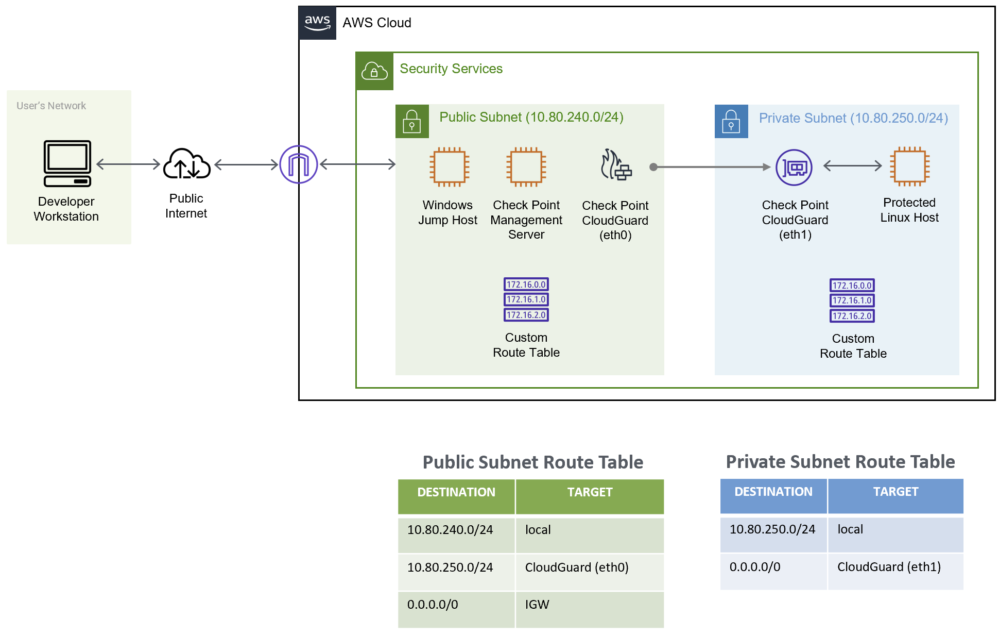
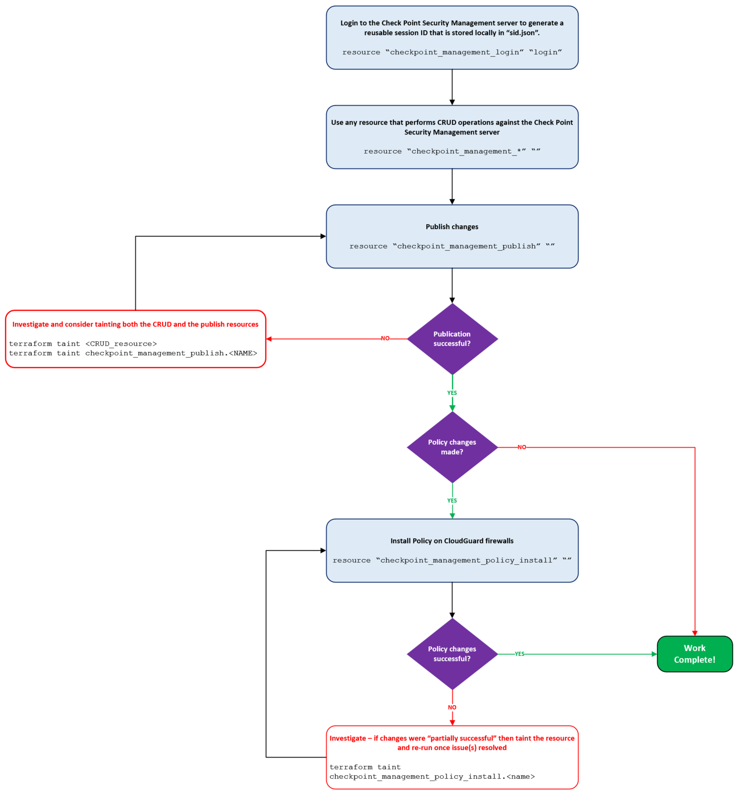
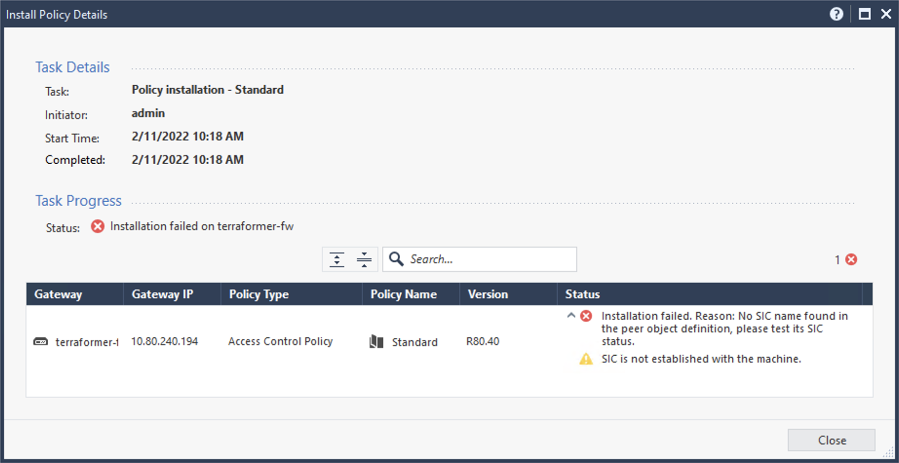

# [ether-net] Check Point CloudGuard #1: Single AWS VPC Deployment
**Article Link:** [PENDING]\
**Difficulty:** Intermediate\
**Assumed Knowledge:**
  - Comfortable using Terraform for simple AWS deployments
  - AWS EC2 (instances, security groups) and netwoking (VPC basics)
  - Exposure to Check Point GAIA OS, CLISH commands, and Smart Console
  - Bash scripting and Linux permissions basics

 *Please consider starring this repo if you found it helpful!*
 
 

## Overview

This repository constructs the below architecture in AWS.  
 

  

 
 

## Learning Objectives

By the end of this lab you should be able to:

1. Deploy Check Point infrastructure in AWS with Terraform;
2. Identify requirements to successfully "bootstrap" Check Point AWS EC2 instances through the `user_data` attribute
3. Explain the strengths and weaknesses associated with the official Check Point Terraform provider. 
 

## Pre-Requisites
1. An AWS account that has subscribed to the following AWS Marketplace [Check Point offerings](https://aws.amazon.com/marketplace/seller-profile?id=a979fc8a-dd48-42c8-84cc-63d5d50e3a2f&ref=dtl_B07KSBV1MM):
   - Check Point Security Management
   - CloudGuard Network Security Next-Gen Firewall with Threat Prevention
2. Terraform OSS installed on your computer and configured to work with AWS. For help with this, refer to HELPFUL RESOURCES.
3. Verify your public IP address by going to [WhatIsMyIPAddress](https://whatismyipaddress.com/). This is required to secure external access to the lab environment.
4. The Terraform environment variable `CHECKPOINT_TIMEOUT` must be created and set to `15000`. It represents the number of milliseconds (default: 3000) before Terraform assumes a CRUD operation has failed. If you do not set this then please consult 'KNOWN ISSUE #N' for errors you may encounter.

 

## Terraform Requirements

| Name | Version |
|------|---------|
| terraform | >= 1.0.2 |
| aws | ~> 3.0 |
| checkpoint | 1.6.0 |
| tls | 3.1.0 | 

 

## Costs
 

> *ether-net will not be held liable for any costs incurred with AWS services or AWS Marketplace subscriptions.*
You, and you alone, are responsible for reviewing all costs associated with the resources deployed per this repository.
It is strongly recommended to use the [AWS Pricing Calculator](https://calculator.aws/#/) as the below prices are subject to change.

 

Please review the below table for cost estimates (USD), noting pricing assumes that the default aws region and instance types remain unchanged in `variables.tf`.
Check Point offer a free 30-day trial for new AWS Marketplace subscriptions - consult the terms and conditions associated with the trial to understand whether it offsets Software Costs in the below table.  
 

| Resource | Default Instance Type | EC2 Cost | Software Cost | Total Cost |
|----------|-----------------------|----------|---------------|------------|
| Amazon Linux 2 HVM Kernel 5.10 | `t2.micro` | `$0.00 p/h` | - | `$0.00 p/h` |
| Check Point CloudGuard Network Security Next-Gen Firewall with Threat Prevention | `$0.085 p/h` | `$0.80 p/h` | `$0.885 p/h` |
| Check Point Security Management | `m5.xlarge` | `$0.096 p/h` | `$0.49 p/h` | `$0.586 p/h` |
| Windows Server 2022 Base | `m4.large` | `$0.192 p/h` | - | `$0.192p/h` |
 

**TOTAL COST ESTIMATE (USD): `$1.663 p/h` + `$0.05 per GB` (Data Transfer OUT from EC2 to Internet)** 
 

## Basic Usage
For a full walkthrough please go to either [ether-net article name](https://ether-net.com/) or reference the DOCS folder for a PDF walkthrough.

1. Clone repo into desired working directory
2. Review the VARIABLES section and set mandatory values within the supplied `terraform.tfvars` file
3. Initialise the Terraform backend and perform an apply - the initial build process takes ~25 minutes to complete
4. Update `AccessKey.pem` permissions to be read-only (else SSH will fail due to insecure keys)
5. RDP to "bastion" to install and configure PuTTY - this will allow you to SSH via EC2 private IP addresses to optimise data transfer costs:
   - Copy `AccessKey.pem` to the Desktop
   - Open PuTTYgen, import `AccessKey.pem`, define a passphrase, and export the Private Key as a .ppk
   - Open PuTTY, In the left-hand pane click "Connection", expand "SSH", select "Auth"
      - Click "Browse" and import the `.ppk` file that was exported
      - In the left-hand pane click "Session", select "Default Settings", and then click "Save"; this ensures all connections will use your AWS private key!
6. While connected to "bastion" open Microsoft Edge and navigate to `https://private_ip_mgmt-svr/`
   - Login with `admin` and password defined by `var.cp_passwd`
   - Download and install SmartConsole (~450MB size)
   - Login with the username `admin`, the password defined by `var.cp_passwd`, and connect to `mgmt-svr` private IP address
7. SSH to both `cloudguard-fw` and `mgmt-svr` and:
   - Enter expert mode with the command `expert` and enter the password specified by `var.cp_passwd`
   - If `var.cp_admin_shell` was changed from its default value then start `bash`
   - Enter the command `cat /var/log/aws-user-data.log` and verify that:
      - `cloudguard-fw`: blink configuration was succesful
      - `mgmt-svr`: `policy-install` was successful for (ignore warnings, they are expected).
8. Uncomment all Check Point references within `providers.tf` and `version.tf`; re-initialise Terraform
9. Open `checkpoint.tf` and uncomment code blocks per lab instructions.
10. Open the `cleanup_checkpoint` directory and run either the bash/powershell cleanup script to remove Check Point configuration from the Terraform state file.
11. Run `terraform destroy --auto-approve` to decommission all AWS resources.

 

## Using the Official Check Point Terraform Provider
 

> **WARNING** \
This flowchart assumes that Basic Usage Steps 1 thru 6 have been completed successfully!

 

  

 
 
 

## Variables

| Name | Description | Type | Default | terraform.tfvars value required |
|------|-------------|------|---------|:--------:|
| wan_ip | A public IPv4 address that is permitted access to the AWS environment by means of module.security_group ingress rule | `string` | - | Yes |
| keys_algorithm | The encruption algorithm to use for private key generation | `string` | `RSA` | No |
| keys_rsa_bits | The number of bits to use with keys_algorithm, higher is stronger | `number` | `2048` | No |
| aws_region | Region to deploy all AWS constructs in | `string` | `us-east-1` | No |
| aws_azs | AWS Availability Zone(s) for resources | `list(string)` | `["us-east-1a"]` | No |
| aws_vpc_name | Name for the VPC infrastructure is being deployed in | `string` | `security` | No |
| aws_vpc_cidr | The CIDR block associated with vpc_name | `string` | `10.80.0.0/16` | No |
| aws_public_subnet | Publicly accessible subnet, must be derived from subnet defined in `aws_vpc_cidr` | `string` | `10.80.240.0/24` | No |
| aws_protected_subnet | A public subnet where all ingress/egress traffic is first inspected by the Check Point CloudGuard security appliance, must be derived from subnet defined in `aws_vpc_cidr` | `string` | `10.80.250.0/24` | No |
| aws_ami_owner_amazon | AWS owner ID for Amazon Linux | `string` | `137112412989` | No |
| aws_ami_owner_checkpoint |  AWS owner ID for Check Point | `string` | `679593333241` | No |
| aws_ami_owner_microsoft | AWS owner ID for Microsoft | `string` | `801119661308` | No |
| aws_ami_name_amazon_linux | AWS AMI name for Amazon Linux | `string` | `amzn2-ami-kernel-5.10-hvm-2.0.20220121.0-x86_64-gp2` | No |
| aws_ami_name_cp_cloudguard | AWS AMI name for Check Point CloudGuard firewall | `string` | `Check Point CloudGuard IaaS GW PAYG-NGTP R80.40-294.983-60f17231-5e1f-4d8b-9381-735a780fcb0f` | No |
| aws_ami_name_cp_security_management | AWS AMI name for Check Point Security Management server | `string` | `Check Point CloudGuard IaaS PAYG-MGMT25 R80.40-294.983-3a503465-b9ae-44ea-85be-ac107b7647a7` | No |
| aws_ami_name_ms_WinServer2022 | AWS AMI name for Windows Server 2022 | `string` | `Windows_Server-2022-English-Full-Base-2021.12.15` | No |
| aws_ec2_type_amazon_linux | EC2 instance type - Amazon Linux | `string` | `t2.micro` | No |
| aws_ec2_type_WinServer2022 | EC2 instance type - Windows Server 2022, used for "bastion" | `string` | `m4.large` | No | 
| aws_ec2_type_cp_cloudguard | EC2 instance type - Check Point CloudGuard firewall | `string` | `c5.large` | No | 
| aws_ec2_type_cp_security_management | EC2 instance type - Check Point Security Management - if you select an instance < 8GB RAM refer to `checkpoint_mgmt.sh` "optional config" to ensure the API server starts automatically | `string` | `m5.xlarge` | No |  
| aws_ec2_ntp_primary | Primary NTP Server to use for EC2 instances | `string` | `169.254.169.123` | No |
| cp_mgmt_hostname | Hostname for the Check Point Security Management server | `string` | `mgmt-svr` | No |
| cp_fw_hostname | Hostname for the Check Point CloudGuard security appliance | `string` | `cloudguard-fw` | No |
| cp_timezone | Time zone for Check Point appliances | `string` | `Etc / GMT` | No |
| cp_admin_shell | The default admin shell to use on Check Point appliances | `string` | `/etc/cli.sh` | No |
| cp_passwd | "admin" account password and expert mode password for Check Point appliances | `string` | - | Yes |
| cp_sic | default Pre-Shared key for secure internal communications (SIC) between Check Point Management Server and CloudGuard appliance(s) | `string` | `Tester2022!` | No |

 

## Known Issues

Any issues raised against this repo that are resolved per below instructions will be automatically closed.

 

---
### Issue #1: HTTPS, SSH and/or RDP traffic to AWS EC2 instances times out

 

**LIKELY CAUSES**  
1. Incorrect public IPv4 address specified for the variable `wan_ip` which has resulted in `module.security_group` possessing a misconfigured ingress permit rule.
This causes the Security Group to drop ALL external traffic destined to EC2 instances.
2. Firewall and/or proxy service dropping traffic from your network to AWS public IPv4 addresses.

 

**RESOLUTION STEPS**  
1. Go to [WhatIsMyIPAddress](https://whatismyipaddress.com/) and verify that the output value matches the value provided in `terraform.tfvars` for the variable `wan_ip`
2. Configure rule(s) to permit traffic from your network to AWS public IPv4 addresses

 

---
### Issue #2: Initial Terraform Plan/Apply fails due to Check Point provider issues

 

**LIKELY CAUSE**  
References to the Check Point provider/resources have been uncommented in `providers.tf`, `version.tf`, and `checkpoint.tf` prior to the base infrastructure having been deployed. 

 

**RESOLUTION STEPS**  
Comment out all Check Point Terraform provider related configuration until you have reached "Basic Usage: Step 5".

 

**ADDITIONAL NOTES**  
Terraform currently does not support `depends_on` within provider blocks, as such ALL providers must be instantiated during the plan/apply stage IRRESPECTIVE of dependant infrastructure state.
Refer to [GitHub hashicorp/terraform Issue #2430](https://github.com/hashicorp/terraform/issues/2430) for commentary surrounding this problem and why it exists.

 

---
### Issue #3: Check Point provider calls are 403 Forbidden

 

**LIKELY CAUSES**  
1. `user_data/checkpoint_mgmt.sh` was not used to bootstrap the management server
2. The bootstrap script `user_data/checkpoint_mgmt.sh` failed to configure the mgmt_api properly

 

**RESOLUTION STEPS**  
1. Follow instructions per [Check Point R81 Managing Security through API](https://sc1.checkpoint.com/documents/R81/WebAdminGuides/EN/CP_R81_SecurityManagement_AdminGuide/Topics-SECMG/Managing-Security-through-API.htm)
to manually configure it via Smart Console on the "bastion" host. 

 

>REQUEST  
Please consider opening an issue and attaching `/var/log/aws-user-data.log` from `mgmt-svr` so that I can update broken bootstrap scripts.

 

**ADDITIONAL NOTES**  
The default behaviour for Check Point Management Servers (or appliances running the Management Blade) is to only permit API calls that originate from an appliance itself (e.g.: allow localhost 127.0.0.1).

 

---
### Issue #4: checkpoint_management_login.login fails

 

**LIKELY CAUSE**  
The Check Point Terraform provider in `providers.tf` has been configured incorrectly.

 

**RESOLUTION STEPS**  
Verify the below attributes have been configured correctly in `providers.tf`.

| Atttribute | Expected Value |
|------------|----------------|
| Server     | `module.maagement_server.public_ip` |
| Username   | `"admin"` |
| Password   | `var.cp_passwd` |
| Context    | `"web_api"` |

 

---
### Issue #5: checkpoint_management_simple_gateway.terraformer_fw times out

 

**EXAMPLE ERROR**  

    | Error: Post "https://`MGMT-SERVER_PUBLIC_IP`/web_api/add-simple-gateway": context deadline exceeded (Client.Timeout exceeded while awaiting headers) 
    │ with checkpoint_management_simple_gateway.terraformer_fw,
    │   on checkpoint.tf line 155, in resource "checkpoint_management_simple_gateway" "terraformer_fw":
    │     155: resource "checkpoint_management_simple_gateway" "terraformer_fw" {

 

**LIKELY CAUSE**  
Environment variable `CHECKPOINT_TIMEOUT` has not been explicitly set, so Terraform assumes resource provisioning fails if no response is received within 3000ms.
It is highly likely for the `add-simple-gateway` API call to take up to 5 seconds (or longer) because:
1. It requires SIC to be established between `mgmt-svr` and `cloudguard-fw`; and
2. This operation automatically triggers a POST to /web_api/publish to ensure changes are committed.

 

**RESOLUTION STEPS**  
1. Verify with "terraform state list" that the resource WAS NOT created
   - If the resource was created, remove it from the state file with "terraform state rm checkpoint_management_simple_gateway.terraformer_fw" command
2. Set the environment variable `CHECKPOINT_TIMEOUT` to `15000`.

 

---
### Issue #6: Error thrown for checkpoint_management_install_policy.exercise2

 

**EXAMPLE ERROR**  

      │ Error: 
      │ 
      │   with checkpoint_management_install_policy.exercise2,
      │   on checkpoint.tf line 126, in resource "checkpoint_management_install_policy" "exercise2":
      │  126: resource "checkpoint_management_install_policy" "exercise2" {

 

**CAUSE**  
`checkpoint.tf` lines 126-135 have been prematurely uncommented. This causes the install_policy process to trigger before Secure Internal Communication (SIC) has been established between the Security Management Server and the newly created CloudGuard appliance. The install_policy resource throws this generic non-descript error and fails to be created.

 

 

**RESOLUTION STEPS**
* In `checkpoint.tf` follow the instructions per the comment block above line 126.

 

**NOTES**  
Check Point have highlighted that Terraform does not support publish and install-policy procedures, so it is recommended for this process to use an [out-of-band method through Go scripts](https://registry.terraform.io/providers/CheckPointSW/checkpoint/latest/docs) [see section: "Post Apply/Destroy Commands"]. This lab explicitly highlights this known issue, however, using the "out-of-band method" will be covered in a separate lab.

---
 

## Additional Resources

These are resources that I strongly recommend if you intend to work with Check Point through Terraform.

* [Official Check Point Software CloudGuard IaaS Github Repo](https://github.com/CheckPointSW/CloudGuardIaaS)
* [Terraform Check Point Official Provider Docs](https://registry.terraform.io/providers/CheckPointSW/checkpoint/latest/docs)
* [Check Point Management API Reference v1.8](https://sc1.checkpoint.com/documents/latest/APIs/index.html#~v1.8%20)